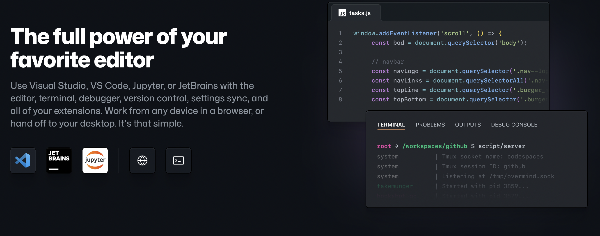
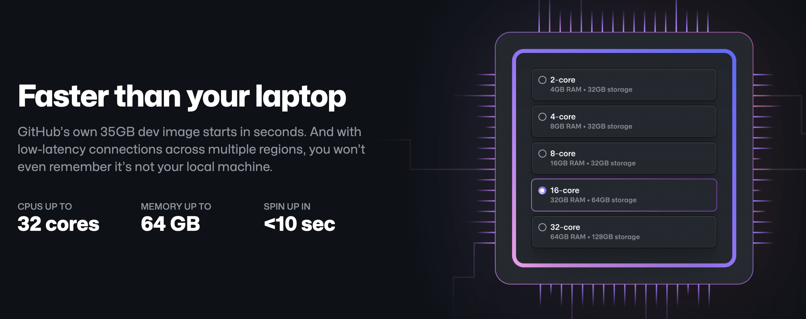
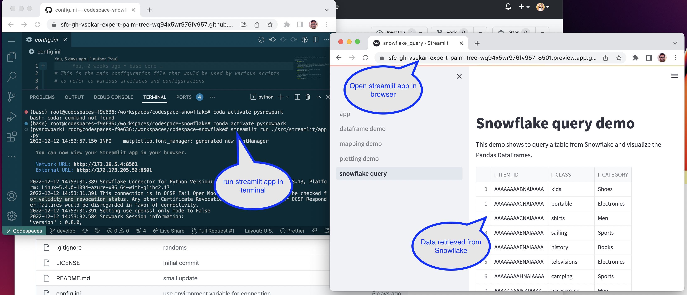
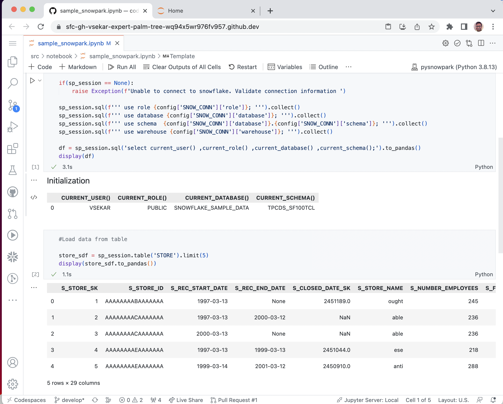
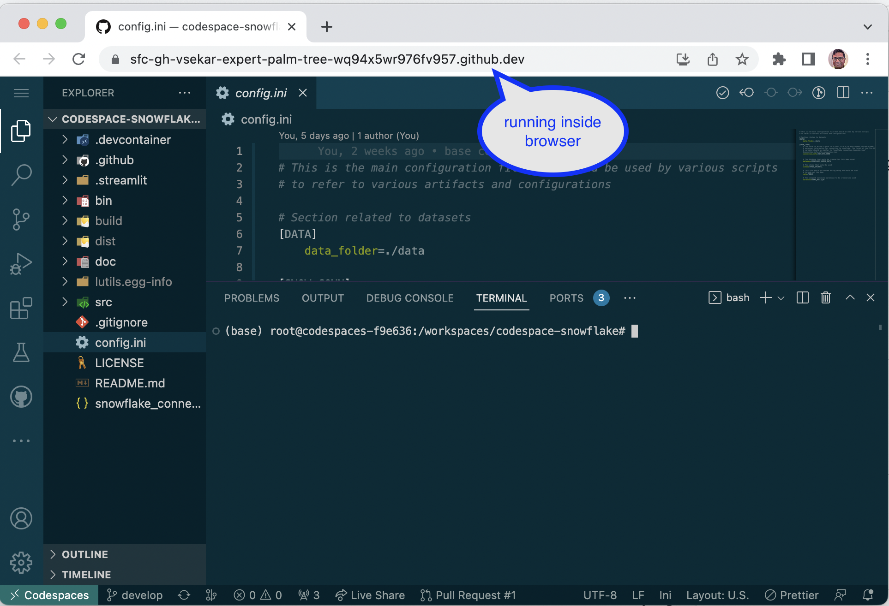

# CodeSpaced Snowflake template

This is a reference sample implementation of artifacts that defines a development environment using [GitHub Codespaces](https://github.com/features/codespaces).

## Overview

### The scenarios
#### Scenario 1: Quick demo 
At Snowflake, we develop a lot of demo assets that we showcase and share with our Customers. Community developers also wants to run many of our demos that we share with them, via [Snowflake Labs](https://github.com/Snowflake-Labs). There is a constant need to showcase specific functionality or solutions using Snowflake to our clients. We are a diverse group of individuals with varying knowledge and skillsets, some of us are well experienced in Java while others are experienced in Python and other language so on so-forth. 

Installing and setting these demoable assets takes time and effort. We have to ensure the asset works in our machines i.e., Mac M1 vs Windows vs Mac Intel etc.. We need to ensure that the proper JDK or python libraries and thier versions are defined correctly. We also have to execute SQL scripts, Snowpark scripts etc.. in the right order. For an SE/CTO it does take a quiet considerable amount of time to make it work. In my own experience, though i am well versed in Python, i typically anticipate atleast 1/2 day for a demo to get it up and running. 

#### Scenario 2: Unified IDE experience
Like a good population of Cloud & Data engineers; in a project we typically have various artifacts. SQL Scripts, Python Scripts, Bash shell scripts, IAC, Notebooks etc... with each of these assets performing specific functionality in the overall project. As typical in a project different team members interact with these resources and participate in creating, updating, maintaing these resources based on the project deliverables.

As of today there are tools/IDE exists which are very diverse. But the code repository where all these asset resides together for a single project is sometimes not feasible. It would be ideal if we have a single IDE experience where the team can work-together to work uniformly across all these assets and achieve the intended project goal.

### Enter Github Codespace
[Github Codespace](https://github.com/features/codespaces), is one such offering which allows to spin up fully configured dev environments in the cloud that start in seconds. It essentially provides a Docker environment and can host popular IDE tools like Visual Code, Jupyter Notebooks, Streamlit apps etc.. 

The docker can run in various machine types too

So how does this help in the earlier mentioned scenarios

#### Scenario 1: Quick demo 
Engineers can spin up the DEMO environment with just a click of a button. Just by providing the target Snowflake demo account; they can be guided by a Streamlit app which can run the various sql scripts in a guided manner. The Streamlit app could also demonstrate the outcomes of the solutions 

Also with the ability to run Jupyter notebooks SEs can quickly demonstrate the ML engineering capabilities quickly without the need to set these up locally.

With the VisualCode IDE, they can walk through the code and showcase the functionality to the client

All of this, with no installation needed to be done on thier MAC. Saving the valuable time and effort and making them productive. To concentreate on other tasks.

Also, once the demo is done; the codespace can be spundown manually or automatically.

Another note to observe is that our Customers, who want to try the demo themselves can now perform this, with minimal efforts. Thus speedingup quickstarts.

#### Scenario 2: Unified IDE experience

For the team, seeking a unified IDE experience. The Docker container is pre-configured with :
 - Visual Code IDE (with pre-configured extensions)
 - SnowSQL
 - Snowpark
 - Streamlit
 - Jupyter

This facilitates to have a single repo that will host all the different artifacts (SQL Scripts, Python , IAC etc..,) together. And will help simplify the CI/CD pipeline processes too.

### Template

#### So how does this work out?
This repo is providing a base template of a "CodeSpaced" project. The template has defined

- Pre-configured Docker container with all the necessary libraries
- Sample SQL scripts
- Sample Streamlit app
- Sample Jupter Notebook

I have provided [documentation](doc/Docs.md) that walks through how to go about configuring and customizing functionalities based on your needs.

#### Can I retrofit my existing demo?
Yes, you can with some tweaks. Recomend that you go over the [documentation](doc/Docs.md). You should be able to realize the appropriate changes to your project structure and make this possible.

Feel free to reach out.

### References
 - [Codespaces](https://github.com/codespaces)
 - [Development container spec](https://containers.dev/)
 - [Discussion on making Streamlit work in Codespace](https://discuss.streamlit.io/t/how-to-make-streamlit-run-on-codespaces/24526/5)
 - [Codespace examples](https://github.com/codespaces-examples/base)
 - [Anaconda devcontainer template](https://github.com/devcontainers/images/tree/main/src/anaconda)
 - [Configuring prebuild Codespace](https://docs.github.com/en/codespaces/prebuilding-your-codespaces/configuring-prebuilds)

## Limitations & TODO

- Currently I have the docker defined only for python based project. Would need to define a docker for Java, based on interest from the community. Volunteers welcome!!
  
- Update codespace to use JupyterLab as documented at: [Article: Using Codespaces with JupyterLab](https://github.blog/changelog/2022-11-09-using-codespaces-with-jupyterlab-public-beta/)